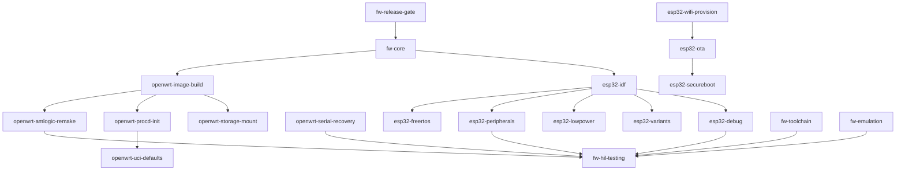

# firmware-skills

**可验证、按需加载的嵌入式固件 Agent Skills** — OpenWrt（嵌入式 Linux 网关固件）与 ESP32（MCU 固件）双家族，附跨平台横切与发布门禁。

[English](./README.md) | 简体中文

> 规划原则复刻自 [rust-skills](../rust-skills)：核心入口 + Hand-off 路由 DAG、dated offline baseline + 运行时核验、任务分型先行、硬件契约反幻觉、证据三层分离（结构校验 / golden 示例 / scenarios forward-test）、诚实完成标准（`Build Verification Only`）。

## 技能清单（20）

| 层级 | 技能 | 职责 |
|---|---|---|
| 核心入口 | `fw-core` | 固件任务分型（Linux 网关 / MCU / no_std）与总路由 |
| OpenWrt | `openwrt-image-build` | Image Builder `make image`、PACKAGES/FILES 合并语义、可复现构建 |
| OpenWrt | `openwrt-amlogic-remake` | ophub amlogic-s9xxx-openwrt remake 链路（N1/盒子→eMMC） |
| OpenWrt | `openwrt-procd-init` | rc.common/procd init.d 体系与启动序 |
| OpenWrt | `openwrt-uci-defaults` | UCI/uci-defaults/uHTTPd/防火墙首启配置 |
| OpenWrt | `openwrt-storage-mount` | block-mount/USB 存储自动挂载协作 |
| OpenWrt | `openwrt-serial-recovery` | 串口/U-Boot 救砖与排障 |
| ESP32 | `esp32-idf` | ESP-IDF 工程构建/menuconfig/分区表 |
| ESP32 | `esp32-freertos` | FreeRTOS 任务/队列/内存 |
| ESP32 | `esp32-peripherals` | GPIO/I2C/SPI/UART/ADC/PWM/RMT |
| ESP32 | `esp32-wifi-provision` | Wi-Fi 配网（NVS/smartconfig/BLE） |
| ESP32 | `esp32-ota` | 双分区 A/B OTA 与回滚 |
| ESP32 | `esp32-lowpower` | deep sleep/RTC/ULP 低功耗 |
| ESP32 | `esp32-secureboot` | secure boot v2/flash/NVS 加密 |
| ESP32 | `esp32-debug` | JTAG/OpenOCD/coredump/gdbstub |
| ESP32 | `esp32-variants` | C3/S3/C6/H2 芯片差异与选型 |
| 横切 | `fw-toolchain` | 交叉工具链锚定（musl/riscv/xtensa） |
| 横切 | `fw-emulation` | QEMU/宿主机模拟（无板测试） |
| 横切 | `fw-hil-testing` | HIL 硬件在环验收矩阵与证据链 |
| 门禁 | `fw-release-gate` | 版本策略/命名/校验和/发布证据 |

## 路由 DAG（单向，防循环）



## 安装

```bash
npx skills add full-stack-skills/firmware-skills --list   # 仅查看
npx skills add full-stack-skills/firmware-skills          # 交互安装
```

## 仓库结构

```
firmware-skills/
├── skills/<name>/            # SKILL.md（≤500 行）+ references/ + examples/
├── evaluation/scenarios.json # 触发/交接断言用例（forward-test）
├── scripts/validate_skills.py# 结构/清单/链接/行数/frontmatter 校验
├── PHASE-2-EVALUATION.md     # ESP32 家族扩容边界评审
└── TRACE-REPORT.md           # 日期化评测基线与证据
```

## 离线基线（dated，不自动更新）

| 域 | 基线 | 依据 |
|---|---|---|
| OpenWrt | 25.12.5（armsr/armv8；IB `FILES=`/`prepare_rootfs` 语义） | 上游源码走读 2026-09-02 |
| ophub amlogic | 上游 HEAD `c593d56`（N1 板型 id=`s905d`，内核 6.12.y stable） | remake 脚本走读 2026-09-02 |
| ESP-IDF | 以官方 release 页核验后锁定（见 `evaluation/baseline-espidf.md`） | Phase 2 实测 |

## License

Apache-2.0
